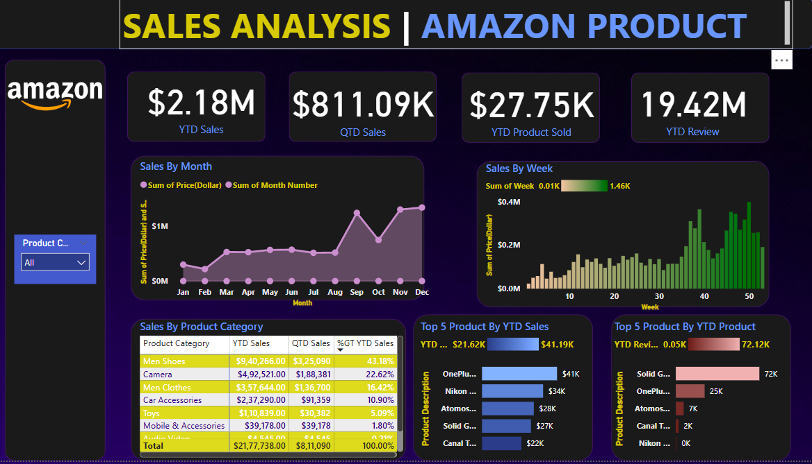
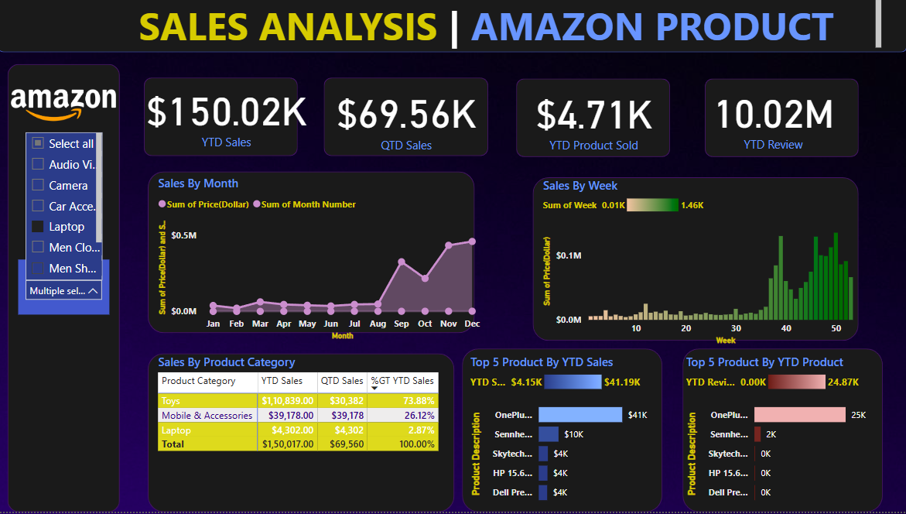

# 🌍 Global Life Expectancy Analysis using WHO Dataset  

## 📖 Overview  
This project analyzes **Global Life Expectancy** using the **WHO Dataset**.  
The goal is to uncover key health trends, patterns, and factors affecting life expectancy worldwide.  

The analysis was performed using **Power BI**, with dashboards designed to provide interactive insights.  

---

## 📊 Dashboard Screenshots  

  

  

  

---

## 📑 Insights (PDF Report)  
Detailed insights can be found in the [Insights.pdf](Insights.pdf).  

---

## 🔧 Tools & Technologies  
- **Power BI** – Dashboard & Visualization  
- **WHO Dataset (Kaggle)** – Source of data  
- **Data Cleaning & Processing** – Excel / Power Query  

---

## 🚀 Key Findings  
- 📈 Life expectancy varies significantly by **region & income group**.  
- 🏥 **Healthcare expenditure** is directly related to better life expectancy.  
- 👶 Higher **child mortality rates** negatively impact overall life expectancy.  
- 🌍 Developed countries show consistently higher life expectancy compared to developing nations.  

---

## 👨‍💻 Author  
**Anmol Pandey**  
- 📫 Reach me at: `anmolpandey6790@gmail.com`  
- 🌐 [LinkedIn](https://www.linkedin.com/in/anmol-pandey-08b864297) | [Kaggle](https://www.kaggle.com/anmolpandey01) | [Instagram](https://www.instagram.com/anmol_pandey_6790)  

---

✨ *"Data is the new oil, but insights are the new gold!"*
